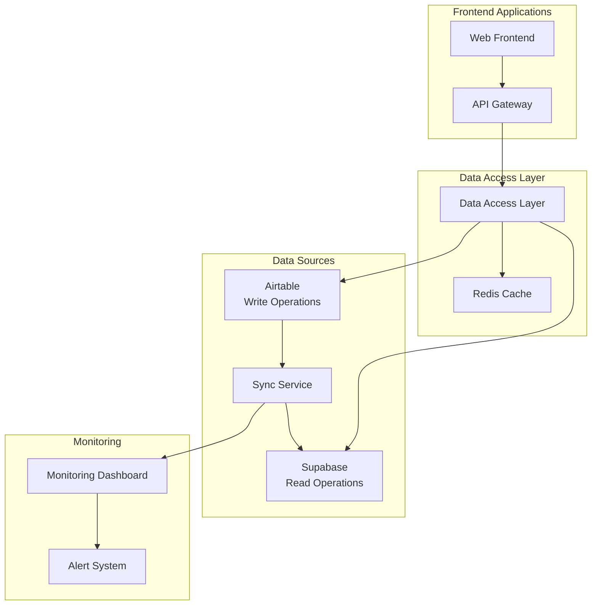
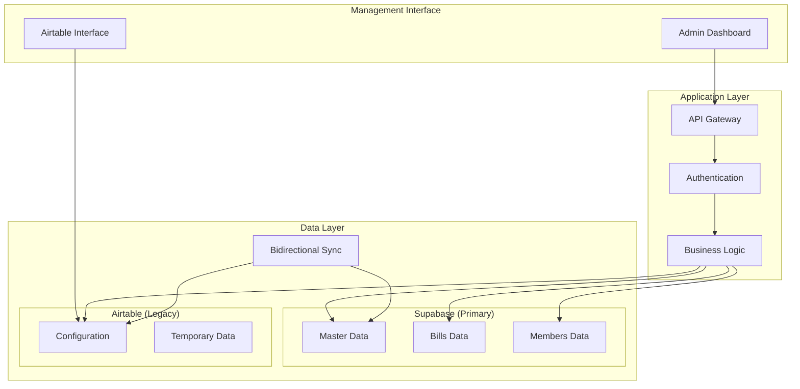

# Airtable to Supabase Migration - Design Document

## Overview

本設計は、現在のAirtableベースのデータ管理システムをSupabase（PostgreSQL）に段階的に移行するハイブリッドアーキテクチャを構築します。パフォーマンス向上（API応答速度50-80%改善）とスケーラビリティ確保（5req/sec → 数百同時接続）を実現しながら、管理者の運用継続性を保持する3段階のアプローチを採用します。

## Architecture

### Phase 1: Hybrid Read Architecture (2-3週間)



### Phase 2: Selective Migration Architecture (3-6ヶ月)



## Components and Interfaces

### 1. Data Access Layer (DAL)

```python
class HybridDataAccessLayer:
    def __init__(self):
        self.supabase_client = SupabaseClient()
        self.airtable_client = AirtableClient()
        self.cache_client = RedisClient()
        self.config = MigrationConfig()
    
    async def get_bills(self, filters: Dict) -> List[Bill]:
        """
        読み取りクエリの優先順位:
        1. Redis Cache
        2. Supabase (Primary)
        3. Airtable (Fallback)
        """
        cache_key = self._generate_cache_key("bills", filters)
        
        # Cache check
        cached_result = await self.cache_client.get(cache_key)
        if cached_result:
            return cached_result
        
        try:
            # Primary: Supabase
            result = await self.supabase_client.get_bills(filters)
            await self.cache_client.set(cache_key, result, ttl=300)
            return result
        except Exception as e:
            # Fallback: Airtable
            logger.warning(f"Supabase query failed, falling back to Airtable: {e}")
            result = await self.airtable_client.get_bills(filters)
            return result
    
    async def update_bill(self, bill_id: str, data: Dict) -> Bill:
        """
        書き込みは現在Airtableのみ（Phase 1）
        """
        result = await self.airtable_client.update_bill(bill_id, data)
        
        # 同期トリガー
        await self.trigger_sync(bill_id)
        
        # キャッシュ無効化
        await self.invalidate_cache_pattern(f"bills:*{bill_id}*")
        
        return result
```

### 2. Synchronization Service

```python
class AirtableSupabaseSyncService:
    def __init__(self):
        self.airtable = AirtableClient()
        self.supabase = SupabaseClient()
        self.conflict_resolver = ConflictResolver()
        self.metrics = SyncMetrics()
    
    async def sync_table(self, table_name: str, sync_mode: str = "incremental"):
        """
        テーブル単位での同期処理
        """
        try:
            if sync_mode == "full":
                await self._full_sync(table_name)
            else:
                await self._incremental_sync(table_name)
                
            self.metrics.record_success(table_name)
            
        except Exception as e:
            self.metrics.record_error(table_name, str(e))
            await self._handle_sync_error(table_name, e)
    
    async def _incremental_sync(self, table_name: str):
        """
        差分同期の実装
        """
        last_sync = await self._get_last_sync_timestamp(table_name)
        
        # Airtableから変更データを取得
        changes = await self.airtable.get_changes_since(table_name, last_sync)
        
        for change in changes:
            await self._apply_change_to_supabase(change)
        
        await self._update_sync_timestamp(table_name)
    
    async def _apply_change_to_supabase(self, change: ChangeRecord):
        """
        個別変更の適用
        """
        if change.operation == "CREATE":
            await self.supabase.insert(change.table, change.data)
        elif change.operation == "UPDATE":
            await self.supabase.update(change.table, change.id, change.data)
        elif change.operation == "DELETE":
            await self.supabase.delete(change.table, change.id)
```

### 3. Schema Mapping Service

```python
class SchemaMapper:
    """
    AirtableとSupabaseのスキーマ差異を吸収
    """
    
    def __init__(self):
        self.mapping_config = self._load_mapping_config()
    
    def airtable_to_supabase(self, table_name: str, airtable_record: Dict) -> Dict:
        """
        AirtableレコードをSupabase形式に変換
        """
        mapping = self.mapping_config[table_name]
        supabase_record = {}
        
        for at_field, sb_field in mapping["field_mappings"].items():
            if at_field in airtable_record:
                value = airtable_record[at_field]
                
                # データ型変換
                if sb_field["type"] == "jsonb" and isinstance(value, (list, dict)):
                    supabase_record[sb_field["name"]] = json.dumps(value)
                elif sb_field["type"] == "uuid" and isinstance(value, str):
                    supabase_record[sb_field["name"]] = self._convert_to_uuid(value)
                else:
                    supabase_record[sb_field["name"]] = value
        
        return supabase_record
    
    def _load_mapping_config(self) -> Dict:
        """
        スキーママッピング設定の読み込み
        """
        return {
            "Bills": {
                "field_mappings": {
                    "Bill Number": {"name": "bill_number", "type": "varchar"},
                    "Title": {"name": "title", "type": "text"},
                    "Policy Categories": {"name": "policy_categories", "type": "jsonb"},
                    "Members": {"name": "member_ids", "type": "uuid[]"},
                    "Status": {"name": "status", "type": "varchar"},
                    "Created Time": {"name": "created_at", "type": "timestamp"},
                    "Last Modified Time": {"name": "updated_at", "type": "timestamp"}
                }
            },
            "Members": {
                "field_mappings": {
                    "Name": {"name": "name", "type": "varchar"},
                    "Party": {"name": "party", "type": "varchar"},
                    "House": {"name": "house", "type": "varchar"},
                    "Bills": {"name": "bill_ids", "type": "uuid[]"}
                }
            }
        }
```

## Data Models

### Supabase Schema Design

```sql
-- Bills テーブル
CREATE TABLE bills (
    id UUID PRIMARY KEY DEFAULT gen_random_uuid(),
    airtable_id VARCHAR(50) UNIQUE NOT NULL, -- Airtableとの紐付け
    bill_number VARCHAR(50) NOT NULL,
    title TEXT NOT NULL,
    status VARCHAR(50) NOT NULL,
    policy_categories JSONB, -- CAP準拠の階層構造
    submission_date DATE,
    house_of_origin VARCHAR(20),
    bill_type VARCHAR(50),
    created_at TIMESTAMP WITH TIME ZONE DEFAULT NOW(),
    updated_at TIMESTAMP WITH TIME ZONE DEFAULT NOW(),
    sync_version INTEGER DEFAULT 1 -- 同期バージョン管理
);

-- Members テーブル
CREATE TABLE members (
    id UUID PRIMARY KEY DEFAULT gen_random_uuid(),
    airtable_id VARCHAR(50) UNIQUE NOT NULL,
    name VARCHAR(255) NOT NULL,
    party VARCHAR(100),
    house VARCHAR(20),
    constituency VARCHAR(255),
    created_at TIMESTAMP WITH TIME ZONE DEFAULT NOW(),
    updated_at TIMESTAMP WITH TIME ZONE DEFAULT NOW(),
    sync_version INTEGER DEFAULT 1
);

-- Bills_Members 中間テーブル（多対多リレーション）
CREATE TABLE bills_members (
    id UUID PRIMARY KEY DEFAULT gen_random_uuid(),
    bill_id UUID REFERENCES bills(id) ON DELETE CASCADE,
    member_id UUID REFERENCES members(id) ON DELETE CASCADE,
    role VARCHAR(50), -- 'submitter', 'supporter', etc.
    created_at TIMESTAMP WITH TIME ZONE DEFAULT NOW(),
    UNIQUE(bill_id, member_id, role)
);

-- Policy Categories テーブル（CAP準拠階層）
CREATE TABLE policy_categories (
    id UUID PRIMARY KEY DEFAULT gen_random_uuid(),
    airtable_id VARCHAR(50) UNIQUE NOT NULL,
    code VARCHAR(20) NOT NULL, -- CAP code (e.g., "1.2.3")
    name VARCHAR(255) NOT NULL,
    level INTEGER NOT NULL, -- 1, 2, 3
    parent_id UUID REFERENCES policy_categories(id),
    created_at TIMESTAMP WITH TIME ZONE DEFAULT NOW(),
    updated_at TIMESTAMP WITH TIME ZONE DEFAULT NOW()
);

-- Bills_PolicyCategories 中間テーブル
CREATE TABLE bills_policy_categories (
    id UUID PRIMARY KEY DEFAULT gen_random_uuid(),
    bill_id UUID REFERENCES bills(id) ON DELETE CASCADE,
    category_id UUID REFERENCES policy_categories(id) ON DELETE CASCADE,
    created_at TIMESTAMP WITH TIME ZONE DEFAULT NOW(),
    UNIQUE(bill_id, category_id)
);

-- 同期管理テーブル
CREATE TABLE sync_status (
    id UUID PRIMARY KEY DEFAULT gen_random_uuid(),
    table_name VARCHAR(100) NOT NULL,
    last_sync_at TIMESTAMP WITH TIME ZONE,
    sync_mode VARCHAR(20), -- 'incremental', 'full'
    status VARCHAR(20), -- 'success', 'error', 'in_progress'
    error_message TEXT,
    records_processed INTEGER DEFAULT 0,
    created_at TIMESTAMP WITH TIME ZONE DEFAULT NOW()
);

-- インデックス作成
CREATE INDEX idx_bills_bill_number ON bills(bill_number);
CREATE INDEX idx_bills_status ON bills(status);
CREATE INDEX idx_bills_policy_categories ON bills USING GIN(policy_categories);
CREATE INDEX idx_members_name ON members(name);
CREATE INDEX idx_members_party ON members(party);
CREATE INDEX idx_policy_categories_code ON policy_categories(code);
CREATE INDEX idx_policy_categories_level ON policy_categories(level);
```

### Migration Data Structures

```python
@dataclass
class MigrationConfig:
    """移行設定"""
    phase: int  # 1, 2, 3
    tables_to_migrate: List[str]
    read_preference: str  # 'supabase', 'airtable', 'hybrid'
    write_preference: str  # 'airtable', 'supabase', 'both'
    sync_interval: int  # seconds
    cache_ttl: int  # seconds
    rollback_enabled: bool

@dataclass
class SyncMetrics:
    """同期メトリクス"""
    table_name: str
    records_synced: int
    sync_duration: float
    errors_count: int
    last_sync_timestamp: datetime
    data_consistency_score: float
```

## Error Handling

### Conflict Resolution Strategy

```python
class ConflictResolver:
    """データ競合解決"""
    
    def resolve_conflict(self, airtable_record: Dict, supabase_record: Dict) -> Dict:
        """
        競合解決ルール:
        1. 最新更新時刻を優先
        2. Airtableを信頼できるソースとして扱う（Phase 1-2）
        3. 重要フィールドは手動確認を要求
        """
        if not airtable_record.get("Last Modified Time"):
            return supabase_record
        
        if not supabase_record.get("updated_at"):
            return airtable_record
        
        at_modified = parse_datetime(airtable_record["Last Modified Time"])
        sb_modified = parse_datetime(supabase_record["updated_at"])
        
        if at_modified > sb_modified:
            return airtable_record
        else:
            # 重要フィールドの変更は手動確認
            critical_fields = ["title", "bill_number", "status"]
            if self._has_critical_changes(airtable_record, supabase_record, critical_fields):
                raise ConflictRequiresManualResolution(
                    airtable_record, supabase_record, critical_fields
                )
            
            return supabase_record
```

### Rollback Mechanism

```python
class RollbackManager:
    """ロールバック管理"""
    
    async def create_rollback_point(self, phase: int) -> str:
        """ロールバックポイントの作成"""
        rollback_id = f"rollback_{phase}_{int(time.time())}"
        
        # Supabaseのスナップショット作成
        await self._create_supabase_snapshot(rollback_id)
        
        # 設定のバックアップ
        await self._backup_configuration(rollback_id)
        
        return rollback_id
    
    async def execute_rollback(self, rollback_id: str) -> bool:
        """ロールバック実行"""
        try:
            # データベース復旧
            await self._restore_supabase_snapshot(rollback_id)
            
            # 設定復旧
            await self._restore_configuration(rollback_id)
            
            # キャッシュクリア
            await self._clear_all_caches()
            
            return True
        except Exception as e:
            logger.error(f"Rollback failed: {e}")
            return False
```

## Testing Strategy

### Phase 1 Testing

```python
class Phase1TestSuite:
    """Phase 1: 読み取り専用移行のテスト"""
    
    async def test_read_performance(self):
        """読み取りパフォーマンステスト"""
        # Airtableベースライン測定
        airtable_times = await self._measure_airtable_queries()
        
        # Supabase性能測定
        supabase_times = await self._measure_supabase_queries()
        
        # 50%以上の改善を確認
        improvement = (airtable_times - supabase_times) / airtable_times
        assert improvement >= 0.5, f"Performance improvement {improvement:.2%} < 50%"
    
    async def test_data_consistency(self):
        """データ整合性テスト"""
        airtable_data = await self.airtable_client.get_all_bills()
        supabase_data = await self.supabase_client.get_all_bills()
        
        consistency_score = self._calculate_consistency(airtable_data, supabase_data)
        assert consistency_score >= 0.95, f"Data consistency {consistency_score:.2%} < 95%"
    
    async def test_fallback_mechanism(self):
        """フォールバック機能テスト"""
        # Supabaseを無効化
        await self._disable_supabase()
        
        # Airtableフォールバックを確認
        result = await self.dal.get_bills({})
        assert len(result) > 0, "Fallback to Airtable failed"
        
        # Supabaseを復旧
        await self._enable_supabase()
```

### Integration Testing

```python
class IntegrationTestSuite:
    """統合テスト"""
    
    async def test_sync_accuracy(self):
        """同期精度テスト"""
        # Airtableでデータ変更
        test_bill = await self._create_test_bill_in_airtable()
        
        # 同期実行
        await self.sync_service.sync_table("Bills")
        
        # Supabaseで確認
        synced_bill = await self.supabase_client.get_bill(test_bill.id)
        assert synced_bill.title == test_bill.title
    
    async def test_concurrent_access(self):
        """同時アクセステスト"""
        tasks = []
        for i in range(100):
            task = asyncio.create_task(self.dal.get_bills({"limit": 10}))
            tasks.append(task)
        
        results = await asyncio.gather(*tasks)
        assert all(len(result) == 10 for result in results)
```

## Performance Considerations

### Caching Strategy

```python
class CacheManager:
    """キャッシュ管理"""
    
    def __init__(self):
        self.redis = RedisClient()
        self.cache_config = {
            "bills": {"ttl": 300, "pattern": "bills:*"},
            "members": {"ttl": 600, "pattern": "members:*"},
            "policy_categories": {"ttl": 3600, "pattern": "categories:*"}
        }
    
    async def get_or_set(self, key: str, fetch_func: Callable, ttl: int = 300):
        """キャッシュ取得または設定"""
        cached = await self.redis.get(key)
        if cached:
            return json.loads(cached)
        
        data = await fetch_func()
        await self.redis.setex(key, ttl, json.dumps(data, default=str))
        return data
    
    async def invalidate_pattern(self, pattern: str):
        """パターンマッチでキャッシュ無効化"""
        keys = await self.redis.keys(pattern)
        if keys:
            await self.redis.delete(*keys)
```

### Query Optimization

```sql
-- 複雑なクエリの最適化例
-- CAP階層検索の高速化
WITH RECURSIVE category_hierarchy AS (
    -- L1カテゴリ
    SELECT id, code, name, level, parent_id, ARRAY[id] as path
    FROM policy_categories 
    WHERE level = 1
    
    UNION ALL
    
    -- 子カテゴリ
    SELECT c.id, c.code, c.name, c.level, c.parent_id, ch.path || c.id
    FROM policy_categories c
    JOIN category_hierarchy ch ON c.parent_id = ch.id
)
SELECT DISTINCT b.*, array_agg(ch.name) as category_names
FROM bills b
JOIN bills_policy_categories bpc ON b.id = bpc.bill_id
JOIN category_hierarchy ch ON bpc.category_id = ch.id
WHERE ch.code LIKE '1.2%'  -- L1.L2で絞り込み
GROUP BY b.id;
```

## Security Considerations

### Data Access Control

```python
class SecurityManager:
    """セキュリティ管理"""
    
    def __init__(self):
        self.supabase_rls_policies = self._setup_rls_policies()
    
    def _setup_rls_policies(self):
        """Row Level Security設定"""
        return [
            # 管理者のみ書き込み可能
            """
            CREATE POLICY admin_write_policy ON bills
            FOR ALL TO authenticated
            USING (auth.jwt() ->> 'role' = 'admin');
            """,
            
            # 一般ユーザーは読み取りのみ
            """
            CREATE POLICY public_read_policy ON bills
            FOR SELECT TO anon, authenticated
            USING (true);
            """
        ]
    
    async def validate_api_access(self, user_role: str, operation: str, table: str) -> bool:
        """API アクセス検証"""
        permissions = {
            "admin": {"bills": ["read", "write"], "members": ["read", "write"]},
            "user": {"bills": ["read"], "members": ["read"]},
            "anonymous": {"bills": ["read"]}
        }
        
        return operation in permissions.get(user_role, {}).get(table, [])
```

## Migration Timeline

### Phase 1: 読み取り専用移行 (2-3週間)

**Week 1:**
- Supabaseプロジェクト設定
- スキーマ設計・作成
- 初期データ移行

**Week 2:**
- 同期サービス実装
- Data Access Layer実装
- 基本テスト実行

**Week 3:**
- パフォーマンステスト
- 本番環境デプロイ
- 監視設定

### Phase 2: 段階的機能移行 (3-6ヶ月)

**Month 1-2:**
- マスタデータ移行（Policy Categories, Members）
- 管理画面プロトタイプ作成

**Month 3-4:**
- Bills データ移行
- 双方向同期実装

**Month 5-6:**
- 管理画面完成
- ユーザートレーニング
- 完全移行準備

### Phase 3: 評価と最適化 (1-2ヶ月)

**Month 1:**
- パフォーマンス評価
- ユーザーフィードバック収集

**Month 2:**
- 最適化実装
- 完全移行判断