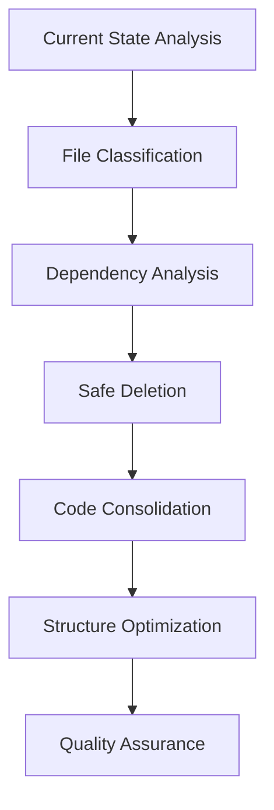

# Design Document

## Overview

このリファクタリングプロジェクトは、Diet Issue Trackerのコードベースを整理し、保守性を向上させることを目的としています。このプロジェクトは国会議事録追跡システムで、2025年7月にMVPを完了し、現在は追加機能開発段階にあります。

### Project Context

**プロジェクトの現状:**
- **MVP完了**: 2025年7月にMVP開発完了、参議院選挙に合わせてリリース
- **アーキテクチャ**: 3サービス構成（ingest-worker、api-gateway、web-frontend）+ 共有ライブラリ
- **データ戦略**: Airtable（構造化データ） + Weaviate Cloud（ベクターデータ）
- **開発状況**: 9つのEPIC、62のチケット中58完了

### Current State Analysis

**問題のあるファイルパターン:**
- `services/ingest-worker/`: 200以上のファイル、多くが日付付きの一時ファイル（例：`*_20250713_*.json`）
- `services/api_gateway/`: 複数の重複したテストファイルとサーバーファイル
- `services/web-frontend/` と `services/web-frontend-new/`: 2つのフロントエンドが並存
- 共有ライブラリの依存関係が一部コメントアウト状態
- 大量の分析・バックアップファイルが開発ディレクトリに蓄積

**技術的負債の背景:**
- 急速なMVP開発により一時的なスクリプトが蓄積
- データ移行・品質改善の過程で多数のバックアップファイル生成
- 複数の実験的アプローチによる重複実装
- ドキュメント化された包括的な仕様に対してコードが散在

## Architecture

### Refactoring Strategy

リファクタリングは以下の段階的アプローチで実行します：



### Target Architecture

```
├── services/
│   ├── ingest-worker/          # Cleaned and organized
│   │   ├── src/               # Core source code
│   │   ├── tests/             # Consolidated tests
│   │   └── docs/              # Service documentation
│   ├── api-gateway/           # Streamlined API service
│   │   ├── src/
│   │   │   ├── routes/        # API endpoints
│   │   │   ├── middleware/    # Auth and other middleware
│   │   │   └── services/      # Business logic
│   │   └── tests/             # Unified test suite
│   └── web-frontend/          # Single, consolidated frontend
│       ├── src/
│       │   ├── components/    # React components
│       │   ├── pages/         # Next.js pages
│       │   └── utils/         # Frontend utilities
│       └── tests/             # Frontend tests
├── shared/                    # Enhanced shared library
│   ├── src/shared/
│   │   ├── models/           # Data models
│   │   ├── clients/          # External service clients
│   │   ├── utils/            # Common utilities
│   │   └── types/            # Type definitions
│   └── tests/                # Shared library tests
└── docs/                     # Consolidated documentation
```

## Components and Interfaces

### 1. File Classification System

**Temporary File Detector**
```python
class TemporaryFileDetector:
    def classify_file(self, filepath: str) -> FileClassification:
        # Patterns for temporary files:
        # - Date stamps: *_YYYYMMDD_HHMMSS.*
        # - Backup files: *_backup_*
        # - Test results: *_result_*
        # - Analysis outputs: *_analysis_*
```

**Duplicate File Analyzer**
```python
class DuplicateAnalyzer:
    def find_duplicates(self, directory: str) -> List[DuplicateGroup]:
        # Identify files with similar:
        # - Names (test_*, simple_*)
        # - Content similarity
        # - Functionality overlap
```

### 2. Dependency Graph Builder

**Service Dependency Mapper**
```python
class DependencyMapper:
    def build_dependency_graph(self) -> DependencyGraph:
        # Map imports and usage between:
        # - Services to shared library
        # - Internal service dependencies
        # - External package dependencies
```

### 3. Safe Deletion Engine

**File Safety Checker**
```python
class SafetyChecker:
    def is_safe_to_delete(self, filepath: str) -> SafetyResult:
        # Check if file is:
        # - Referenced in imports
        # - Used in configuration
        # - Required for builds
        # - Part of active functionality
```

### 4. Code Consolidation Manager

**Frontend Merger**
```python
class FrontendMerger:
    def merge_frontends(self, 
                       primary: str = "web-frontend",
                       secondary: str = "web-frontend-new") -> MergeResult:
        # Compare and merge:
        # - Package dependencies
        # - Component implementations
        # - Configuration files
        # - Test suites
```

**Test Suite Consolidator**
```python
class TestConsolidator:
    def consolidate_tests(self, service_path: str) -> ConsolidationResult:
        # Merge duplicate tests
        # Remove obsolete test files
        # Organize test structure
```

## Data Models

### File Classification Models

```python
from enum import Enum
from pydantic import BaseModel
from typing import List, Optional

class FileType(Enum):
    TEMPORARY = "temporary"
    BACKUP = "backup"
    TEST_RESULT = "test_result"
    DUPLICATE = "duplicate"
    CORE = "core"
    CONFIGURATION = "configuration"

class FileClassification(BaseModel):
    filepath: str
    file_type: FileType
    confidence: float
    reason: str
    safe_to_delete: bool
    dependencies: List[str] = []

class DuplicateGroup(BaseModel):
    files: List[str]
    similarity_score: float
    recommended_action: str  # "merge", "delete_all_but_one", "manual_review"
    primary_file: Optional[str] = None
```

### Refactoring Operation Models

```python
class RefactoringOperation(BaseModel):
    operation_type: str  # "delete", "move", "merge", "rename"
    source_files: List[str]
    target_path: Optional[str] = None
    backup_required: bool = True
    risk_level: str  # "low", "medium", "high"

class RefactoringPlan(BaseModel):
    operations: List[RefactoringOperation]
    estimated_files_removed: int
    estimated_size_reduction: str
    risk_assessment: str
```

## Error Handling

### Rollback Mechanism

```python
class RefactoringRollback:
    def create_checkpoint(self) -> str:
        # Create git commit or backup before operations
        
    def rollback_to_checkpoint(self, checkpoint_id: str) -> bool:
        # Restore previous state if issues occur
```

### Validation Framework

```python
class PostRefactoringValidator:
    def validate_build_integrity(self) -> ValidationResult:
        # Ensure all services still build
        
    def validate_test_coverage(self) -> ValidationResult:
        # Ensure test coverage is maintained
        
    def validate_functionality(self) -> ValidationResult:
        # Run smoke tests on core functionality
```

## Testing Strategy

### Pre-Refactoring Tests

1. **Baseline Test Suite**: Capture current test results
2. **Build Verification**: Ensure all services build successfully
3. **Dependency Mapping**: Document current import relationships

### Refactoring Tests

1. **File Classification Tests**: Verify temporary file detection accuracy
2. **Safety Check Tests**: Ensure no critical files are marked for deletion
3. **Merge Logic Tests**: Validate frontend consolidation logic

### Post-Refactoring Tests

1. **Regression Tests**: Ensure no functionality is broken
2. **Build Tests**: Verify all services still build
3. **Integration Tests**: Check service-to-service communication
4. **Performance Tests**: Ensure no performance degradation

### Test Structure Improvements

**Before (Current State):**
```
services/api_gateway/
├── test_*.py (multiple scattered test files)
├── simple_*.py (development test files)
└── validate_*.py (validation scripts)
```

**After (Improved Structure):**
```
services/api_gateway/tests/
├── unit/
│   ├── test_routes.py
│   ├── test_middleware.py
│   └── test_services.py
├── integration/
│   ├── test_api_integration.py
│   └── test_database_integration.py
└── conftest.py
```

## Implementation Phases

### Phase 1: Analysis and Planning (Safe)
- File classification and duplicate detection
- Dependency analysis
- Risk assessment
- Backup creation

### Phase 2: Safe Deletions (Low Risk)
- Remove clearly temporary files (date-stamped backups)
- Delete unused test result files
- Clean up development artifacts

### Phase 3: Code Consolidation (Medium Risk)
- Merge duplicate test files
- Consolidate frontend services
- Organize shared library usage

### Phase 4: Structure Optimization (Medium Risk)
- Reorganize directory structures
- Update import paths
- Consolidate configuration files

### Phase 5: Quality Assurance (Critical)
- Run full test suite
- Verify build integrity
- Performance validation
- Documentation updates

## Risk Mitigation

### Backup Strategy
- Git commit before each phase
- File-level backups for critical operations
- Airtable data export before structural changes
- Weaviate vector data backup if needed

### Incremental Approach
- One service at a time
- Validate after each major change
- Rollback capability at each step
- Preserve MVP functionality throughout refactoring

### Validation Gates
- Automated tests must pass before proceeding
- Manual review for high-risk operations
- Stakeholder approval for structural changes
- Integration with existing CI/CD pipeline

### Documentation Integration
- Update comprehensive docs/ structure during refactoring
- Maintain alignment with existing technical specifications
- Preserve development ticket tracking system
- Update roadmap documentation as needed

### MVP Preservation
- Maintain all completed EPIC functionality
- Preserve Airtable + Weaviate integration
- Keep CI/CD pipeline operational
- Ensure no regression in production features