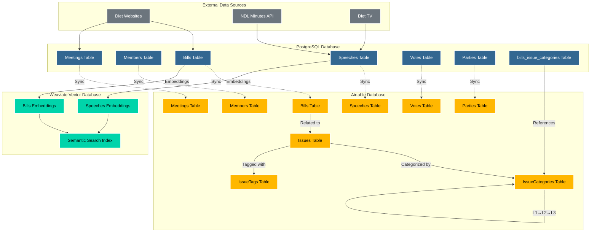
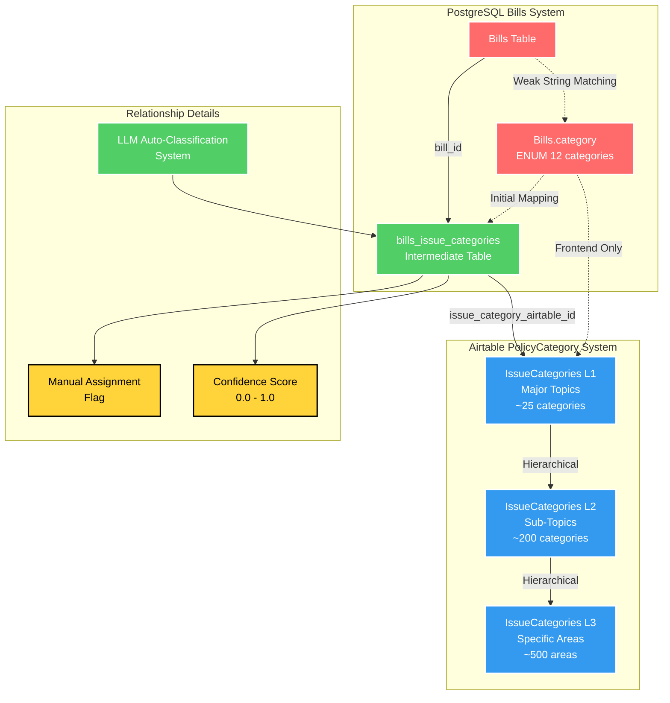

# Bills ↔ PolicyCategory関連付けシステム設計書

## 概要

現在のシステムでは、PostgreSQL Billsテーブルの12個enum categoryとAirtable IssueCategories（PolicyCategory）間に適切な関連付けが存在しない問題を解決する。

## 問題の現状

### 現在の問題
1. **データベース分離**: Bills（PostgreSQL）とIssueCategories（Airtable）が独立
2. **脆弱な関連付け**: フロントエンドが文字列マッチングに依存
3. **概念混同**: PolicyCategory（構造的分類）とIssue（動的抽出）の区別不明確

### 影響範囲
- `/issues/categories/[id].tsx`: 不適切な関連Bills取得
- API設計: Category-based Bills検索の不備
- ユーザー体験: 不正確なカテゴリ→Bills ナビゲーション

## データベースER図

### 1. PostgreSQL完全ER図

```mermaid
erDiagram
    parties {
        int id PK
        string name UK "政党名"
        string name_en "英語名"
        string abbreviation "略称"
        text description "説明"
        string website_url "ウェブサイト"
        string color_code "カラーコード"
        boolean is_active "有効フラグ"
        datetime created_at
        datetime updated_at
    }

    members {
        int id PK
        string name "議員名"
        string name_kana "読み仮名"
        string name_en "英語名"
        int party_id FK
        string house "院（衆議院/参議院）"
        string constituency "選挙区"
        string diet_member_id UK "議員ID"
        string birth_date "生年月日"
        string gender "性別"
        string first_elected "初回当選"
        int terms_served "当選回数"
        text previous_occupations "前職"
        text education "学歴"
        string website_url "ウェブサイト"
        string twitter_handle "Twitterアカウント"
        string facebook_url "Facebook URL"
        boolean is_active "有効フラグ"
        string status "ステータス"
        datetime created_at
        datetime updated_at
    }

    bills {
        int id PK
        string bill_number UK "法案番号"
        string title "タイトル"
        string title_en "英語タイトル"
        string short_title "略称"
        text summary "要約"
        text full_text "全文"
        text purpose "目的"
        enum status "ステータス"
        enum category "カテゴリ"
        string bill_type "法案種別"
        date submitted_date "提出日"
        date first_reading_date "第一読会日"
        date committee_referral_date "委員会付託日"
        date committee_report_date "委員会報告日"
        date final_vote_date "最終採決日"
        date promulgated_date "公布日"
        string diet_session "国会会期"
        string house_of_origin "提出院"
        string submitter_type "提出者種別"
        json submitting_members "提出議員"
        string sponsoring_ministry "主管省庁"
        string diet_url "国会サイトURL"
        string pdf_url "PDF URL"
        json related_bills "関連法案"
        text ai_summary "AI要約"
        json key_points "要点"
        json tags "タグ"
        json impact_assessment "影響評価"
        vector title_embedding "タイトル埋め込み"
        vector content_embedding "内容埋め込み"
        boolean is_controversial "争点法案フラグ"
        string priority_level "優先度"
        string estimated_cost "推定コスト"
        datetime created_at
        datetime updated_at
    }

    meetings {
        int id PK
        string meeting_id UK "会議ID"
        string title "タイトル"
        string meeting_type "会議種別"
        string committee_name "委員会名"
        string diet_session "国会会期"
        string house "院"
        int session_number "会期番号"
        datetime meeting_date "開催日"
        datetime start_time "開始時間"
        datetime end_time "終了時間"
        int duration_minutes "会議時間（分）"
        json agenda "議題"
        text summary "要約"
        text meeting_notes "会議記録"
        string video_url "動画URL"
        string audio_url "音声URL"
        string transcript_url "議事録URL"
        json documents_urls "関連文書URL"
        boolean is_processed "処理済みフラグ"
        boolean transcript_processed "議事録処理済み"
        boolean stt_completed "STT完了フラグ"
        int participant_count "参加者数"
        boolean is_public "公開フラグ"
        boolean is_cancelled "中止フラグ"
        datetime created_at
        datetime updated_at
    }

    speeches {
        int id PK
        int meeting_id FK
        int speaker_id FK
        int related_bill_id FK
        int speech_order "発言順序"
        datetime start_time "開始時間"
        datetime end_time "終了時間"
        int duration_seconds "発言時間（秒）"
        string speaker_name "発言者名"
        string speaker_title "発言者役職"
        string speaker_type "発言者種別"
        text original_text "原文"
        text cleaned_text "整理済みテキスト"
        string speech_type "発言種別"
        text summary "要約"
        json key_points "要点"
        json topics "トピック"
        string sentiment "感情"
        string stance "立場"
        vector content_embedding "内容埋め込み"
        int word_count "語数"
        string confidence_score "信頼度"
        boolean is_interruption "割り込み発言"
        boolean is_processed "処理済み"
        boolean needs_review "レビュー必要"
        datetime created_at
        datetime updated_at
    }

    votes {
        int id PK
        int bill_id FK
        int member_id FK
        string vote_result "投票結果"
        datetime vote_date "投票日"
        string house "院"
        string vote_type "投票種別"
        string vote_stage "投票段階"
        string committee_name "委員会名"
        int total_votes "総投票数"
        int yes_votes "賛成票"
        int no_votes "反対票"
        int abstain_votes "棄権票"
        int absent_votes "欠席票"
        text notes "備考"
        string is_final_vote "最終投票"
        datetime created_at
        datetime updated_at
    }

    bills_issue_categories {
        int id PK
        int bill_id FK
        string issue_category_airtable_id "AirtableカテゴリID"
        float confidence_score "信頼度スコア"
        boolean is_manual "手動設定フラグ"
        datetime created_at
        datetime updated_at
    }

    %% Relationships
    parties ||--o{ members : "party_id"
    members ||--o{ speeches : "speaker_id"
    members ||--o{ votes : "member_id"
    bills ||--o{ speeches : "related_bill_id"
    bills ||--o{ votes : "bill_id"
    bills ||--o{ bills_issue_categories : "bill_id"
    meetings ||--o{ speeches : "meeting_id"
```



### 2. ハイブリッドアーキテクチャ図



### 3. Bills↔PolicyCategory関連付け詳細図



### 4. テーブル構造詳細

#### bills_issue_categories テーブル仕様

| カラム名 | データ型 | 制約 | 説明 |
|---------|----------|------|------|
| id | INTEGER | PRIMARY KEY | 主キー |
| bill_id | INTEGER | NOT NULL, FK to bills(id) | 法案ID |
| issue_category_airtable_id | VARCHAR(50) | NOT NULL | AirtableカテゴリID |
| confidence_score | FLOAT | DEFAULT 1.0 | 関連度スコア (0.0-1.0) |
| is_manual | BOOLEAN | DEFAULT FALSE | 手動設定フラグ |
| created_at | TIMESTAMP | DEFAULT NOW() | 作成日時 |
| updated_at | TIMESTAMP | DEFAULT NOW() | 更新日時 |

#### 主要インデックス

- `idx_bills_categories_bill_id`: bill_id での高速検索
- `idx_bills_categories_airtable_id`: カテゴリID での高速検索
- `idx_bills_categories_confidence`: 信頼度での部分インデックス (>= 0.8)
- `uq_bills_issue_categories_bill_airtable`: 重複防止ユニーク制約

## 解決アーキテクチャ

### 1. 中間テーブル設計

```sql
-- PostgreSQL追加テーブル
CREATE TABLE bills_issue_categories (
  id SERIAL PRIMARY KEY,
  bill_id INTEGER NOT NULL REFERENCES bills(id),
  issue_category_airtable_id VARCHAR(50) NOT NULL,  -- Airtable record ID
  confidence_score FLOAT DEFAULT 1.0,              -- 関連度 (0.0-1.0)
  is_manual BOOLEAN DEFAULT FALSE,                  -- 手動設定フラグ
  assigned_by VARCHAR(50),                          -- 設定者 (user_id or 'auto')
  created_at TIMESTAMP DEFAULT NOW(),
  updated_at TIMESTAMP DEFAULT NOW(),
  UNIQUE(bill_id, issue_category_airtable_id)
);

CREATE INDEX idx_bills_categories_bill_id ON bills_issue_categories(bill_id);
CREATE INDEX idx_bills_categories_category_id ON bills_issue_categories(issue_category_airtable_id);
CREATE INDEX idx_bills_categories_confidence ON bills_issue_categories(confidence_score DESC);
```

### 2. データフロー設計

```
PostgreSQL Bills.category (enum) 
    ↓ [初期マッピング]
bills_issue_categories (中間テーブル)
    ↓ [Airtable ID参照]
Airtable IssueCategories (PolicyCategory)
    ↓ [階層構造]
L1 → L2 → L3 PolicyCategory
```

### 3. API設計

#### Bills関連API拡張
```python
# 既存API拡張
GET  /api/bills/{bill_id}/categories          # Bill関連PolicyCategory取得
POST /api/bills/{bill_id}/categories          # 関連付け追加
DELETE /api/bills/{bill_id}/categories/{cat_id} # 関連付け削除

# PolicyCategory関連API拡張  
GET /api/categories/{category_id}/bills        # Category関連Bills取得
GET /api/categories/{category_id}/bills/count  # 関連Bills数

# 一括操作API
POST /api/bills/categories/bulk-assign         # 一括関連付け
POST /api/bills/categories/auto-classify       # LLM自動分類
```

## 開発フェーズ

### Phase 1: 基盤実装 (1週間)
- **BC-001**: 中間テーブル作成 & マイグレーション
- **BC-002**: 基本API エンドポイント実装

### Phase 2: データ移行 (3日)
- **BC-003**: 既存Bills.category → PolicyCategory マッピング
- **BC-004**: LLM支援自動分類システム

### Phase 3: フロントエンド統合 (1週間)  
- **BC-005**: カテゴリページ修正（文字列マッチング削除）
- **BC-006**: Bills検索・フィルタ機能

### Phase 4: 運用機能 (3日)
- **BC-007**: 管理画面（手動編集・レビュー機能）

## 初期データマッピング

### PostgreSQL Bills.category → Airtable PolicyCategory
```python
ENUM_TO_CATEGORY_MAPPING = {
    'BUDGET': 'rec_L1_budget_finance',          # L1: 予算・金融
    'TAXATION': 'rec_L1_budget_finance',        # L1: 予算・金融  
    'SOCIAL_SECURITY': 'rec_L1_social_welfare', # L1: 社会保障
    'FOREIGN_AFFAIRS': 'rec_L1_foreign_policy', # L1: 外交・国際
    'ECONOMY': 'rec_L1_economy_industry',       # L1: 経済・産業
    'EDUCATION': 'rec_L1_education_culture',    # L1: 教育・文化
    'ENVIRONMENT': 'rec_L1_environment_energy', # L1: 環境・エネルギー
    'INFRASTRUCTURE': 'rec_L1_infrastructure',  # L1: インフラ・交通
    'DEFENSE': 'rec_L1_defense_security',       # L1: 防衛・安全保障
    'JUDICIARY': 'rec_L1_justice_legal',        # L1: 司法・法務
    'ADMINISTRATION': 'rec_L1_administration',  # L1: 行政・公務員
    'OTHER': 'rec_L1_other'                     # L1: その他
}
```

## パフォーマンス要件

- **API応答時間**: 
  - `/api/categories/{id}/bills`: ≤ 200ms (p95)
  - `/api/bills/{id}/categories`: ≤ 100ms (p95)
- **データ整合性**: 中間テーブル更新時のAirtable同期 ≤ 5秒
- **検索性能**: PolicyCategoryによるBills検索 ≤ 300ms

## リスク & 対応策

### 技術的リスク
1. **Airtable API制限**: 5 req/s → バッチ処理 & キャッシュ戦略
2. **データ同期ラグ**: PostgreSQL ↔ Airtable → Eventual consistency受容
3. **マイグレーション複雑性**: 段階的移行 & ロールバック計画

### 運用リスク  
1. **手動メンテナンス負荷**: 管理画面による効率化
2. **分類精度**: LLM + 人手レビューによる品質確保
3. **システム複雑性**: 明確なドキュメント & テスト戦略

## 成功指標

### 技術指標
- Bills ↔ PolicyCategory 関連付け精度 ≥ 90%
- API応答時間改善 (現在の文字列マッチング vs 新API)
- データ整合性エラー率 ≤ 0.1%

### UX指標
- カテゴリページからのBills発見率向上
- PolicyCategory → Bills ナビゲーション精度向上
- ユーザー満足度調査での改善評価

---

**Document Version**: 1.0  
**Created**: 2025-07-15  
**Next Review**: 2025-08-01  
**Owner**: PM Team

---

*この設計書は、Diet Issue Tracker の Bills ↔ PolicyCategory 関連付けシステムの技術仕様として作成されています。実装進捗に応じて適宜更新されます。*