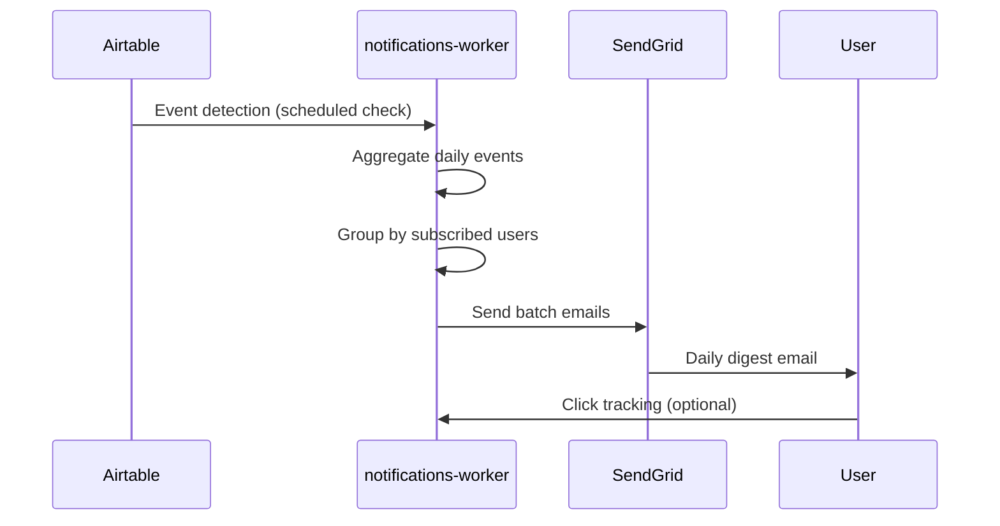

# Notification System — MVP Specification

## 1. Functional Scope

### Event Triggers

#### (A) Bill Stage Changes

```sql
-- Trigger: bills table UPDATE on stage column
-- Detection: stage column value change
-- Events captured:
--   審議中 → 採決待ち (voting imminent)
--   採決待ち → 成立 (bill passed)
--   採決待ち → 否決 (bill failed)
```

#### (B) Committee Meeting Creation

```sql
-- Trigger: meetings table INSERT
-- Detection: new meeting with issue_id mapping
-- Event payload: meeting_date, committee_name, agenda_items
```

### Data Schema

#### Subscriptions Table

```sql
CREATE TABLE subscriptions (
    id UUID PRIMARY KEY,
    user_email VARCHAR(255) NOT NULL,
    issue_id VARCHAR(255) NOT NULL,
    confirmed_at TIMESTAMP,
    unsubscribed_at TIMESTAMP,
    created_at TIMESTAMP DEFAULT NOW(),
    UNIQUE(user_email, issue_id)
);
```

#### Issue Events Table

```sql
CREATE TABLE issue_events (
    id UUID PRIMARY KEY,
    issue_id VARCHAR(255) NOT NULL,
    event_type VARCHAR(50) NOT NULL, -- 'stage_change', 'meeting_created'
    event_payload JSON NOT NULL,
    fingerprint VARCHAR(64) NOT NULL, -- SHA256(event_type + payload)
    happened_at TIMESTAMP NOT NULL,
    processed_at TIMESTAMP,
    UNIQUE(fingerprint)
);
```

### Processing Flow



## 2. Non-Functional Requirements

### Performance

- **Email Processing**: ≤100 emails/minute (SendGrid free tier)
- **Event Detection Latency**: ≤2 hours from source update
- **Daily Batch Window**: 22:00-23:00 JST

### Reliability

- **Retry Logic**: Failed emails retry 3x with exponential backoff
- **Idempotency**: Event fingerprinting prevents duplicates
- **Audit Trail**: All events logged with timestamps

### Security

- **Email Validation**: Double opt-in confirmation
- **Unsubscribe**: One-click unsubscribe in footer
- **Data Retention**: Purge unsubscribed users after 30 days

## 3. Technical Implementation

### Event Detection

```python
class EventDetector:
    async def detect_stage_changes(self) -> List[IssueEvent]:
        """Poll Airtable for stage changes since last check"""
        last_check = await self.get_last_check_timestamp()
        changes = await self.airtable_client.get_bill_updates(since=last_check)

        events = []
        for change in changes:
            if change.field == 'stage':
                event = IssueEvent(
                    issue_id=change.record_id,
                    event_type='stage_change',
                    payload={'old_stage': change.old_value, 'new_stage': change.new_value},
                    happened_at=change.timestamp
                )
                events.append(event)
        return events
```

### Email Template System

```python
# Email template using MJML → HTML compilation
DAILY_DIGEST_TEMPLATE = """
<mjml>
  <mj-body>
    <mj-section>
      <mj-column>
        <mj-text>あなたがウォッチしている法案に動きがありました</mj-text>
        
        <mj-text>
          <h3>{{ event.issue_title }}</h3>
          <p>{{ event.description }}</p>
          <a href="{{ event.detail_url }}">詳細を見る</a>
        </mj-text>
        
      </mj-column>
    </mj-section>
  </mj-body>
</mjml>
"""
```

## 4. Roadmap Extensions

### Phase 2: Speech Volume Spike Detection (2026 Q1)

```python
class SpeechSpikeDetector:
    """Detect unusual debate activity indicating political crisis"""

    async def detect_volume_spikes(self, issue_id: str) -> Optional[SpikeEvent]:
        # Analyze speech frequency/duration over rolling 7-day window
        # Trigger when volume > 2 standard deviations above mean
        pass
```

---

**Document Version**: 1.1  
**Created**: 2025-07-13  
**Updated**: 2025-07-16  
**Review Date**: 2025-07-20

## Implementation Status

**Status**: NOT IMPLEMENTED  
**Last Updated**: 2025-07-16

### Current State

- **Frontend**: WatchButton.tsx contains only skeleton code with TODO comments
- **Backend**: No subscription/notification services implemented
- **Database**: subscriptions and issue_events tables not created
- **API**: No notification endpoints implemented

### Next Steps

Implementation should follow development tickets T124-T127 in development-tickets-final.md
