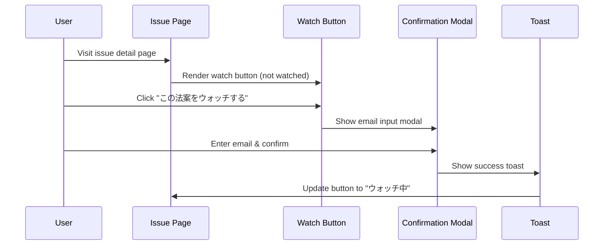
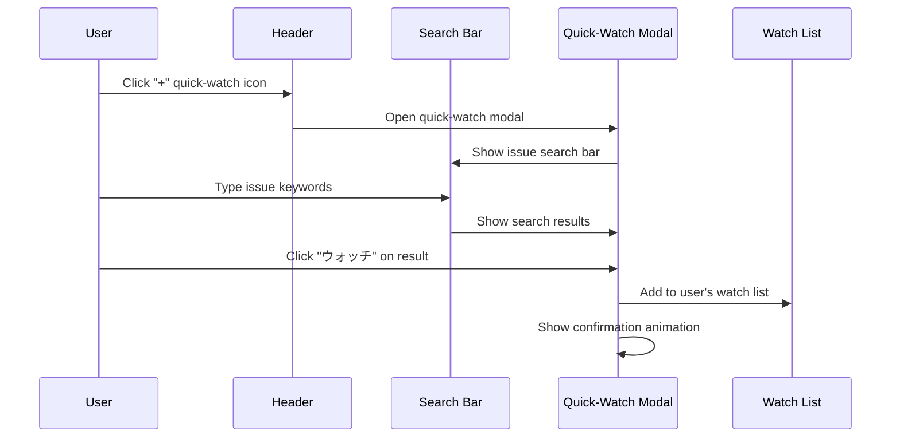

# Notification UX Flow Specification

## User Journey Flows

### A. Issue Detail Page Watch Flow



### B. Header Quick-Watch Flow



## Component States

### Watch Button States

```typescript
type WatchButtonState =
  | "not_watching" // Default: "この法案をウォッチする"
  | "loading" // "送信中..."
  | "watching" // "ウォッチ中 ✓" + unwatch option
  | "error"; // "エラーが発生しました" + retry
```

### Modal States

```typescript
type ModalState =
  | "email_input" // Email form
  | "confirming" // "確認メールを送信しています..."
  | "confirmed" // "ウォッチリストに追加されました"
  | "already_exists"; // "既にウォッチ中です"
```

## Accessibility Requirements

### ARIA Implementation

```tsx
<button
  aria-label={isWatching ? "法案のウォッチを停止" : "法案をウォッチする"}
  aria-pressed={isWatching}
  aria-describedby="watch-button-help"
>
  {buttonText}
</button>

<div id="watch-button-help" className="sr-only">
  この法案の進展状況を毎日メールで受け取ります
</div>
```

### Focus Management

```typescript
// Modal open: trap focus within modal
const focusTrap = createFocusTrap("#watch-modal", {
  initialFocus: "#email-input",
  fallbackFocus: "#modal-close-button",
});

// Modal close: return focus to trigger button
onModalClose(() => {
  document.getElementById("watch-button")?.focus();
});
```

### Keyboard Navigation

- **Tab**: Navigate between interactive elements
- **Enter**: Activate watch button or submit form
- **Escape**: Close modal and return focus
- **Arrow Keys**: Navigate search results in quick-watch

## Visual Design Patterns

### Watch Button Design

```css
.watch-button {
  /* Primary state */
  background: var(--primary-green);
  border-radius: 8px;
  padding: 12px 24px;

  /* Watching state */
  &.watching {
    background: var(--success-green);
    border: 2px solid var(--primary-green);
  }

  /* Loading state */
  &.loading {
    opacity: 0.7;
    cursor: not-allowed;
  }
}
```

### Toast Notifications

```typescript
const toastConfig = {
  success: {
    icon: "✓",
    duration: 4000,
    color: "var(--success-green)",
  },
  error: {
    icon: "⚠️",
    duration: 6000,
    color: "var(--error-red)",
  },
};
```

---

**Document Version**: 1.0  
**Created**: 2025-07-13  
**UX Review**: Weekly during implementation
