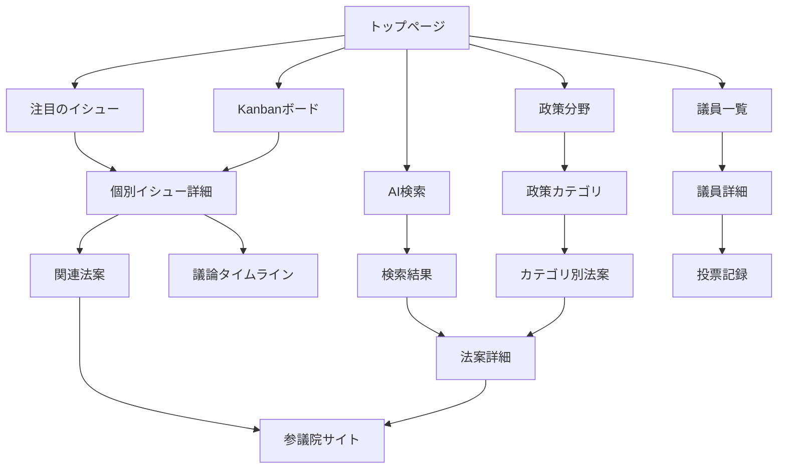

# ユーザー体験仕様書 (User Experience Specification)

**政治ウォッチ！- Diet Issue Tracker**

_Version: 1.0 | Date: 2025-07-12_

---

## 目次

1. [プロダクト概要](#プロダクト概要)
2. [ユーザージャーニー・遷移図](#ユーザージャーニー遷移図)
3. [ページ構成・情報設計](#ページ構成情報設計)
4. [ナビゲーション設計](#ナビゲーション設計)
5. [主要機能・ユーザーフロー](#主要機能ユーザーフロー)
6. [レスポンシブ・アクセシビリティ設計](#レスポンシブアクセシビリティ設計)

---

## プロダクト概要

### ミッション

国会で議論されている政治課題（イシュー）をAIによって分析・整理し、誰の目にもわかりやすく届ける独立した情報プラットフォーム

### コアバリュー

- **透明性**: 国会議案の透明性向上
- **アクセシビリティ**: 誰でも政治情報にアクセス可能
- **中立性**: 政治的中立性の維持
- **AI活用**: 高度な検索・分析機能

### ターゲットユーザー

- **一般市民**: 政治に関心がある個人
- **研究者・ジャーナリスト**: 詳細な政治分析が必要な専門職
- **政策関係者**: 法案動向を追跡する必要がある職業

---

## ユーザージャーニー・遷移図

### メインユーザーフロー



### 詳細遷移パス

#### 1. 発見型フロー (Discovery Flow)

```
TOP → Kanbanボード → イシュー詳細 → 関連法案 → 外部サイト
```

#### 2. 検索型フロー (Search Flow)

```
TOP/発言検索 → 検索結果 → 法案/発言詳細 → 外部サイト
```

#### 3. カテゴリ探索フロー (Category Flow)

```
政策分野 → L1カテゴリ → L2カテゴリ → 関連法案 → 法案詳細
```

#### 4. 議員追跡フロー (Member Flow)

```
議員一覧 → 議員詳細 → 投票統計 → 関連法案
```

---

## ページ構成・情報設計

### サイトマップ

```
政治ウォッチ！
├── / (トップページ)
├── /speeches (発言検索)
├── /members (議員一覧)
├── /issues
│   ├── /issues (イシューボード)
│   ├── /issues/[id] (イシュー詳細)
│   └── /issues/categories
│       ├── /issues/categories (カテゴリ概要)
│       └── /issues/categories/[id] (カテゴリ詳細)
├── /privacy (プライバシーポリシー)
├── /terms (利用規約)
└── /about-data (データについて)
```

### 3層政策分類システム

#### L1: 主要分野 (~25カテゴリ)

- 社会保障 | 経済・産業 | 外交・国際 | 環境・エネルギー
- 教育・文化 | 法務・治安 | 行政・統治 | 等

#### L2: 詳細分野 (~200カテゴリ)

- 健康保険制度改革 | 高齢者介護サービス | 税制改正
- 中小企業支援 | 労働者保護 | 等

#### L3: 具体的イシュー (500-1,000件)

- 介護保険の自己負担率見直し | 法人税率の段階的引き下げ | 等

---

## ナビゲーション設計

### グローバルナビゲーション

#### ヘッダーナビ

```
[政治ウォッチ！] [法案検索] [発言検索] [議員一覧] [政策分野] [イシュー] [法的情報▼]
```

#### フッターナビ

```
法案検索 | 発言検索 | 議員一覧 | 政策分野 | イシュー | 利用規約 | プライバシーポリシー | データについて
```

### ブレッドクラム設計

#### 政策分野ナビゲーション例

```
Home > 政策分野 > 社会保障 > 健康保険制度改革 > 関連法案
```

#### イシュー詳細ナビゲーション例

```
Home > イシュー > 税制改正関連 > 法人税率見直し議論
```

---

## 主要機能・ユーザーフロー

### 1. トップページ体験

#### レイアウト構成

```
[ヘッダーナビゲーション]
[ヒーローセクション: タイトル・説明]
[システムステータス: 緑色インジケーター]
[🔥 注目のイシュー: 横スクロールカード]
[機能紹介: 4つのカード]
[直近1ヶ月の議論: Kanbanボード]
[AI検索インターフェース]
[使い方説明]
[フッター]
```

#### 注目のイシューストリップ

- **表示件数**: 12件のアクティブな議題
- **カードデザイン**: 左境界線で優先度色分け (高:赤/中:黄/低:灰)
- **情報表示**: ステータスバッジ、タイトル、要約、カテゴリ、法案ID、更新日
- **インタラクション**: 横スクロール、ホバーエフェクト

#### Kanbanボード

- **4ステージ**: 審議前(0件) → 審議中(8件) → 採決待ち(0件) → 成立(8件)
- **表示形式**: カード形式、横スクロール対応
- **データソース**: リアルタイムAirtableデータ

### 2. AI検索体験

#### 検索インターフェース

- **入力検証**: 200文字制限、リアルタイムバリデーション
- **検索方式**: ベクトル類似度 + キーワード検索
- **セキュリティ**: レート制限、入力サニタイゼーション
- **UX**: デバウンス処理、ローディング状態

#### 検索結果表示

- **結果フォーマット**: 法案タイトル、要約、関連度スコア、ステータス
- **フィルタリング**: カテゴリ、ステータス、期間での絞り込み
- **ソート**: 関連度、更新日、ステータス順

### 3. イシュー管理体験

#### イシュー詳細ページ

- **タブ構成**: 概要 | 関連法案 | 議論タイムライン
- **関連法案**: 法案カード形式で複数表示
- **議論タイムライン**: 時系列での議論履歴

#### カテゴリ探索

- **階層ナビゲーション**: L1 → L2 → 関連法案
- **CAP基準**: 国際標準政策分類システム準拠
- **統計表示**: カテゴリ別法案数、動向分析

### 4. 議員ディレクトリ体験

#### 仮想化リスト

- **パフォーマンス**: 700+議員の高速表示
- **検索機能**: 日本語テキスト検索(ひらがな・カタカナ・漢字・ローマ字対応)
- **フィルタリング**: 政党別、選挙区別
- **ソート**: 氏名、政党、選挙区順

---

## レスポンシブ・アクセシビリティ設計

### レスポンシブデザイン

#### ブレークポイント

- **Mobile**: ~768px (メイン対象)
- **Tablet**: 768px~1024px
- **Desktop**: 1024px~

#### モバイルファースト設計

- **ナビゲーション**: ハンバーガーメニュー
- **カード表示**: 垂直スタック
- **検索**: フルスクリーン展開
- **Kanban**: 横スクロール最適化

### アクセシビリティ対応

#### 視覚的配慮

- **カラーパレット**: 色覚バリアフリー対応
  - プライマリグリーン: #27AE60
  - エラーレッド: #C0392B
  - 警告イエロー: #F1C40F
- **コントラスト**: WCAG AA準拠
- **フォント**: 明朝体・ゴシック体選択可能

#### 操作的配慮

- **キーボードナビゲーション**: 全機能対応
- **ARIAラベル**: スクリーンリーダー対応
- **フォーカス管理**: 論理的タブ順序
- **ふりがな機能**: 漢字読み支援(実装準備中)

#### 多言語対応

- **日本語メイン**: ひらがな・カタカナ・漢字
- **ローマ字検索**: Wanakana統合
- **英語サブ**: 国際標準用語併記

### パフォーマンス最適化

#### フロントエンド最適化

- **遅延読み込み**: Intersection Observer活用
- **仮想スクロール**: TanStack Virtual
- **プリフェッチ**: Next.jsルーター先読み
- **メモ化**: React.memo, useMemo活用

#### PWA機能

- **サービスワーカー**: オフライン対応
- **マニフェスト**: アプリインストール対応
- **キャッシュ戦略**: Static First + Network Fallback

---

## TOPページ UI設計詳細

### TOPページ概要

#### 設計方針

- **ファーストインプレッション**: 政治の複雑さを軽減し、親しみやすい印象
- **情報階層**: 最重要情報を上部に配置し、段階的な詳細提供
- **アクション指向**: 明確なCTAと直感的な操作性
- **パフォーマンス**: モバイル環境での高速読み込み (<200ms)

#### ページ目標

1. **理解促進**: サービス価値の即座の理解
2. **エンゲージメント**: 注目イシューでの関心喚起
3. **探索促進**: Kanbanボードでの全体俯瞰
4. **行動誘導**: AI検索での深堀りアクション

### レイアウト構成

#### 全体構造

```
┌─────────────────────────────────────────┐
│ Header Navigation                        │
├─────────────────────────────────────────┤
│ Hero Section                            │
├─────────────────────────────────────────┤
│ System Status                           │
├─────────────────────────────────────────┤
│ 🔥 Active Issues Strip                   │
├─────────────────────────────────────────┤
│ Features Overview (4-card grid)         │
├─────────────────────────────────────────┤
│ Kanban Board Section                    │
├─────────────────────────────────────────┤
│ AI Search Interface                     │
├─────────────────────────────────────────┤
│ Usage Instructions                      │
├─────────────────────────────────────────┤
│ Footer Navigation                       │
└─────────────────────────────────────────┘
```

#### レイアウトグリッド

- **コンテナ幅**: 最大1200px、中央配置
- **グリッドシステム**: 12カラム、Tailwind CSS Grid
- **マージン**: 左右24px (モバイル), 48px (デスクトップ)
- **スペーシング**: セクション間 32px-64px

### セクション別詳細設計

#### 1. ヒーローセクション

**デザイン仕様**:

```css
.hero-section {
  background: linear-gradient(135deg, #f8fafc 0%, #e2e8f0 100%);
  border-radius: 16px;
  padding: 64px 32px;
  text-align: center;
  margin-bottom: 32px;
}
```

**コンテンツ構成**:

- [大見出し] 政治ウォッチ！
- [副見出し] 国会で議論されていることを見つめる (italic)
- [説明文] 国会で議論されていることをAIによって分析・整理します...

**タイポグラフィ**:

- **メインタイトル**: 3xl (48px), font-bold, text-gray-900
- **サブタイトル**: xl (24px), font-semibold, text-gray-700, italic
- **説明文**: lg (18px), text-gray-600, max-width: 48rem

#### 2. 🔥 注目のイシューストリップ

**デザイン仕様**:

```css
.active-issues-strip {
  background: white;
  border-radius: 12px;
  box-shadow: 0 4px 6px -1px rgba(0, 0, 0, 0.1);
  padding: 24px;
  margin-bottom: 32px;
}
```

**イシューカード設計**:

```
┌─ 320px ─┐
│ [ステータスバッジ] [カテゴリ]     │
│ タイトル (2行制限)              │
│ 要約テキスト (3行制限)           │
│ 法案ID: xxx... | 2025-07-11   │
└─────────────────────────────┘
```

**カラーコーディング**:

- **高優先度**: border-left: 4px solid #dc2626 (red-600)
- **中優先度**: border-left: 4px solid #d97706 (amber-600)
- **低優先度**: border-left: 4px solid #6b7280 (gray-500)

#### 3. Kanbanボードセクション

**セクション構成**:

```
┌─────────────────────────────────────────┐
│ 直近1ヶ月の議論                           │
│ 16件のイシューを表示中 | ← 横スクロールで確認 → │
├─────────────────────────────────────────┤
│ [審議前] [審議中] [採決待ち] [成立]         │
│    0        8        0       8         │
└─────────────────────────────────────────┘
```

**ステージデザイン**:

- **審議前**: 📋 アイコン、0件
- **審議中**: ⚖️ アイコン、8件、青色テーマ
- **採決待ち**: ⏳ アイコン、0件、オレンジ色テーマ
- **成立**: ✅ アイコン、8件、緑色テーマ

### インタラクションデザイン

#### ホバーエフェクト

```css
.card-interactive:hover {
  transform: translateY(-2px);
  box-shadow: 0 8px 25px rgba(0, 0, 0, 0.15);
  transition: all 0.2s ease-out;
}
```

#### アニメーション

1. **fade-in-up**: 全体コンテナ、0.6s ease-out
2. **stagger-children**: 機能カード群、0.1s間隔
3. **slide-down**: ヒーロータイトル、0.5s ease-out

### 技術実装詳細

#### React コンポーネント構成

```typescript
// pages/index.tsx
export default function Home() {
  return (
    <Layout>
      <HeroSection />
      <SystemStatus />
      <ActiveIssuesStrip />        // EPIC 12 T102
      <FeaturesOverview />
      <KanbanBoard />
      <SearchInterface />
      <UsageInstructions />
    </Layout>
  );
}
```

#### Active Issues API統合

```typescript
// components/ActiveIssuesStrip.tsx
const [activeIssues, setActiveIssues] = useState<ActiveIssue[]>([]);

useEffect(() => {
  const fetchActiveIssues = async () => {
    const response = await fetch(
      "http://localhost:8080/api/issues?status=in_view&limit=12"
    );
    const data = await response.json();
    if (data.success) {
      setActiveIssues(data.data);
    }
  };
  fetchActiveIssues();
}, []);
```

### 品質保証・テスト

#### パフォーマンス目標

- **FCP (First Contentful Paint)**: < 1.0s
- **LCP (Largest Contentful Paint)**: < 2.0s
- **CLS (Cumulative Layout Shift)**: < 0.1
- **Lighthouse スコア**: 90+

#### アクセシビリティ基準

- **WCAG 2.1 AA**: 準拠
- **カラーコントラスト**: 4.5:1以上
- **キーボード操作**: 全機能対応
- **スクリーンリーダー**: NVDA/JAWS対応

---

## 技術仕様サマリー

### フロントエンド技術スタック

- **Framework**: Next.js 13+ (App Router)
- **Language**: TypeScript
- **Styling**: Tailwind CSS
- **State Management**: React Hooks
- **Testing**: Playwright E2E
- **Accessibility**: ARIA, WCAG 2.1 AA

### データ統合

- **API Gateway**: FastAPI + CORS対応
- **データソース**: Airtable (100+ 法案)
- **リアルタイム更新**: RESTful API
- **セキュリティ**: レート制限、入力検証

### 監視・品質保証

- **パフォーマンス**: Lighthouse 90+スコア
- **セキュリティ**: CSP、CSRF対策
- **監視**: 独自observabilityシステム
- **エラートラッキング**: 構造化ログ

---

**文書管理情報**

- 作成日: 2025-07-12
- バージョン: 1.1 - TOPページUI仕様統合
- 更新頻度: 機能追加・変更時
- 承認者: 開発チーム
