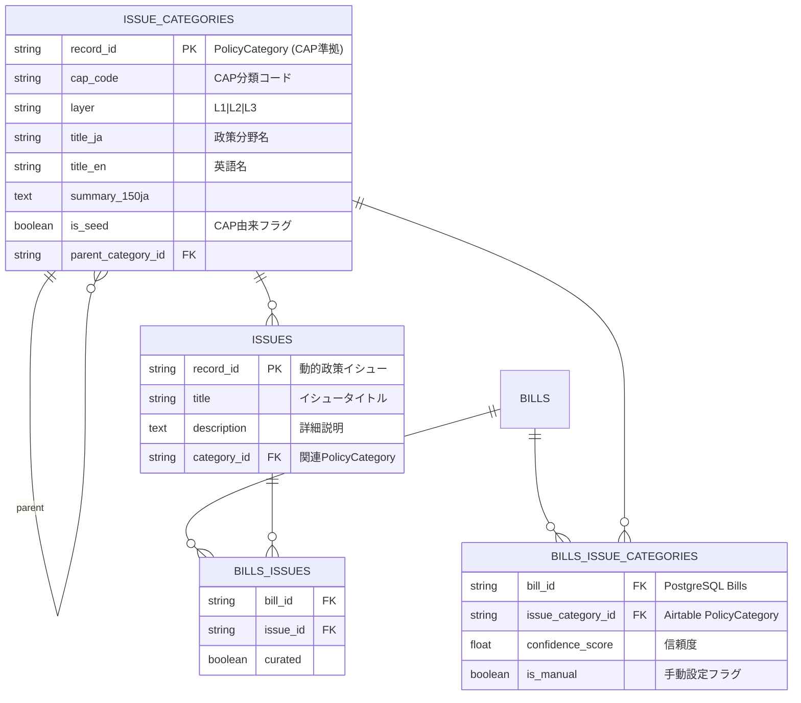

# PolicyCategory & Issue分類機能 — Phase 0: Seed 設計書

## 0. TL;DR
- **目的**: 「社会課題→関連国会アクション」を一発でたどれる Issue-first 情報設計を仕込む  
- **範囲**: CAP準拠の3層PolicyCategory体系のL1/L2を外部コードブックから日本語対訳してAirtableにSeedするところまで  
- **概念区分**: PolicyCategory（構造的分類）とIssue（動的抽出）の明確な分離  
- **締切**: 2025-08-31（Phase 0 完了）

---

## 1. エンティティ図（抜粋）



> **Phase 0 scope**: `ISSUE_CATEGORIES` テーブル（PolicyCategory）に L1/L2 のCAP準拠シードデータを投入し、`is_seed=true` フラグを立てる。`BILLS_ISSUE_CATEGORIES` と `BILLS_ISSUES` は後続フェーズで実装。

> **概念説明**: 
> - `ISSUE_CATEGORIES` = PolicyCategory（CAP準拠の構造的政策分野分類）
> - `ISSUES` = 動的に抽出される具体的政策イシュー
> - `BILLS_ISSUE_CATEGORIES` = Bills ↔ PolicyCategory の関連付け（新規追加予定）

---

## 2. タグ体系

| レイヤー | 想定件数 | 例 | 出典 |
|---|---|---|---|
| **L1 マクロカテゴリ** | 20-30 | 社会保障 / 金融 / 防災 | CAP Major Topics |
| **L2 サブトピック** | 200± | 健康保険制度改革 / 高齢者介護サービス | CAP Sub-Topics |
| **L3 イシュー** | 500-1,000 | 介護保険の自己負担率見直し | 日本独自 *（Phase 1 以降）* |

### シード作業手順
1. **翻訳**  
   - 英語→日本語対訳を DeepL → 人手チェック  
   - 別 CSV: `code,layer,en,title_ja`
2. **スクリプト投入**  
   - `scripts/seed_issue_categories.py` で Airtable に insert  
   - `is_seed=true`, `summary_150ja=''` で空置き

---

## 3. IssueCategory スキーマ（Airtable）

| フィールド | 型 | 説明 |
|---|---|---|
| `CAP_Code` | Single line text | "13", "1305" など |
| `Layer` | Single select | L1, L2, L3 |
| `Title_JA` | Single line text | 日本語タイトル |
| `Title_EN` | Single line text | 英語タイトル |
| `Summary_150JA` | Long text | Phase 0 では空 |
| `Parent_Category` | Link to IssueCategories | 階層関係 |
| `Is_Seed` | Checkbox | CAP由来データフラグ |
| `Created_At` | Date | 作成日時 |
| `Updated_At` | Date | 更新日時 |

---

## 4. ディレクトリ配置

```
docs/
  issue-tagging/
    phase0_seed.md      ← このファイル
data/
  cap_mapping/
    l1_major_topics.csv
    l2_sub_topics.csv
scripts/
  seed_issue_categories.py
```

---

## 5. Phase 0 TODO リスト

| # | タスク | 担当 | 期限 | チケット |
|---|---|---|---|---|
| 1 | CAP Major/Sub-Topics 日本語対訳 | Policy/Legal | 08-15 | T72, T73 |
| 2 | `l1,l2` CSV 整形 & レビュー | Data | 08-20 | T73 |
| 3 | `seed_issue_categories.py` 実装 | Backend | 08-23 | T74 |
| 4 | Airtable テーブル作成 | Backend | 08-13 | T71 |
| 5 | 本番 Airtable への Seed 実行 | DevOps | 08-25 | T74 |
| 6 | API エンドポイント実装 | Backend | 08-26 | T75 |
| 7 | データモデル拡張 | Backend | 08-28 | T76 |
| 8 | フロントエンド実装 | Frontend | 08-30 | T77, T78 |
| 9 | E2E テスト & 品質保証 | QA | 08-31 | T79 |

---

## 6. 期待成果物

1. **Airtable**  
   - `IssueCategories` テーブルに L1= ~25 行, L2= ~200 行  
2. **ドキュメント**  
   - `docs/issue-tagging/phase0_seed.md`（＝本書）  
3. **スクリプト**  
   - `scripts/seed_issue_categories.py`（再実行 idempotent）
4. **API**
   - `/api/issues/categories` エンドポイント群
5. **フロントエンド**
   - `/issues/categories` ページ群

---

## 7. 次フェーズへの布石

- Phase 1 で **手動タグ付け UI** と `summary_150ja` 生成フローを追加  
- Phase 2 で **Embedding 類似度** による候補自動抽出 → QA  
- Phase 3 で **SpeechSegment 熱量計測** と **Crowd 修正提案** を展開

---

## 8. 技術仕様詳細

### 8.1 Airtable API 統合

```python
# AirtableClient 拡張例
async def create_issue_category(self, category_data: Dict[str, Any]) -> Dict[str, Any]:
    """Create a new issue category record."""
    url = f"{self.base_url}/IssueCategories"
    data = {
        "fields": {
            "CAP_Code": category_data["cap_code"],
            "Layer": category_data["layer"],
            "Title_JA": category_data["title_ja"],
            "Title_EN": category_data.get("title_en"),
            "Is_Seed": category_data.get("is_seed", False),
            "Created_At": datetime.now().isoformat(),
            "Updated_At": datetime.now().isoformat()
        }
    }
    
    # Handle parent relationship
    if "parent_category_id" in category_data and category_data["parent_category_id"]:
        data["fields"]["Parent_Category"] = [category_data["parent_category_id"]]
    
    return await self._rate_limited_request("POST", url, json=data)
```

### 8.2 データモデル拡張

```python
# shared/models/issue.py
class IssueCategory(BaseRecord):
    """Issue category model for hierarchical classification."""
    
    cap_code: str = Field(..., description="CAP classification code")
    layer: str = Field(..., description="Hierarchy layer (L1/L2/L3)")
    title_ja: str = Field(..., description="Japanese title")
    title_en: Optional[str] = Field(None, description="English title")
    summary_150ja: Optional[str] = Field("", description="Japanese summary (150 chars)")
    parent_category_id: Optional[str] = Field(None, description="Parent category ID")
    is_seed: bool = Field(False, description="CAP-derived seed data flag")
```

### 8.3 API エンドポイント仕様

```python
# routes/issues.py 拡張
@router.get("/categories", response_model=List[dict])
async def list_issue_categories(
    layer: Optional[str] = Query(None, description="Filter by layer (L1/L2/L3)"),
    parent_id: Optional[str] = Query(None, description="Filter by parent category"),
    airtable: AirtableClient = Depends(get_airtable_client)
):
    """List issue categories with hierarchical filtering."""
    
@router.get("/categories/tree")
async def get_category_tree(
    airtable: AirtableClient = Depends(get_airtable_client)
):
    """Get full category tree structure."""
    
@router.get("/categories/{category_id}/children")
async def get_category_children(
    category_id: str,
    airtable: AirtableClient = Depends(get_airtable_client)
):
    """Get child categories for a specific category."""
```

---

## 9. 品質保証・テスト戦略

### 9.1 データ品質チェック
- CAP コード重複チェック
- 親子関係の循環参照チェック
- 日本語翻訳の専門用語統一
- 階層構造の整合性検証

### 9.2 パフォーマンス要件
- API レスポンス時間 ≤ 200ms (p95)
- 階層クエリの効率化（Airtable リンクフィールド活用）
- フロントエンド描画 ≤ 100ms (カテゴリツリー)

### 9.3 ユーザビリティテスト
- Issue-first ナビゲーションの直感性
- 3クリック以内での目的法案到達
- モバイル対応・アクセシビリティ準拠

---

## 10. リスク管理

### 10.1 技術的リスク
- **Airtable 制約**: レコード数制限（Pro: 50,000件/base）
- **API レート制限**: 5 req/s の制約下でのパフォーマンス
- **階層クエリ複雑性**: 深いネストでの応答時間劣化

### 10.2 運用リスク
- **翻訳品質**: CAP 英語→日本語の政治的妥当性
- **メンテナンス負荷**: L3 レイヤー手動メンテナンスの持続可能性
- **データ同期**: 複数システム間でのカテゴリ整合性

### 10.3 対応策
- 段階的負荷テストによる性能検証
- 政治専門家によるダブルチェック体制
- データ移行計画（Airtable → PostgreSQL）の並行検討

---

**Document Version**: 1.0  
**Last Updated**: 2025-07-10  
**Next Review**: 2025-08-15  
**Approved By**: [To be filled]

---

*この設計書は、Diet Issue Tracker の 3-Layer Issue Categorization System Phase 0 実装の技術仕様書として作成されています。実装進捗に応じて適宜更新されます。*